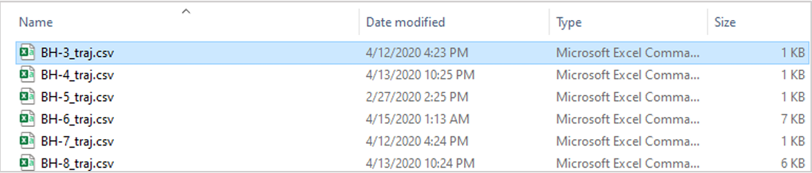
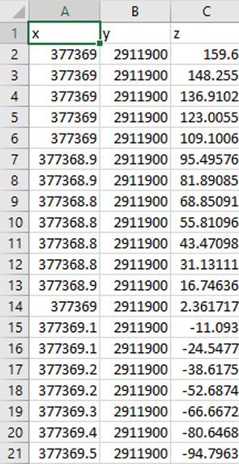
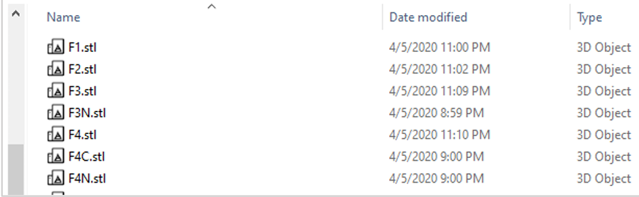
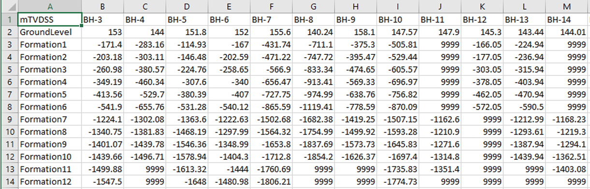
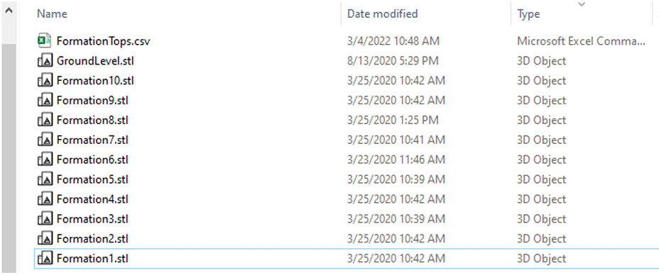
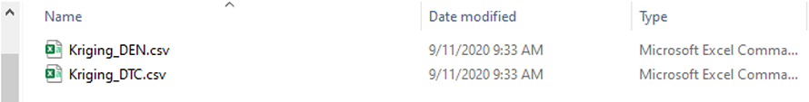
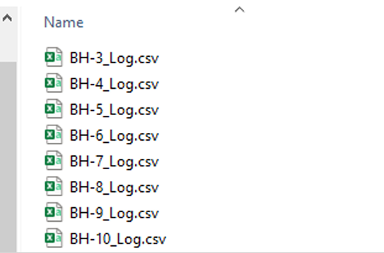
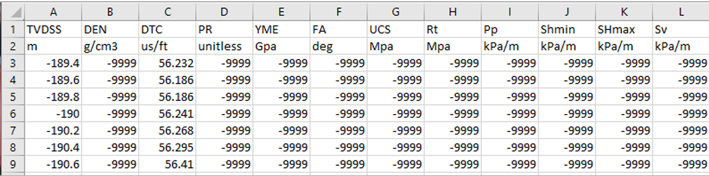
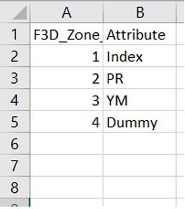

The following functions export FLAC3D model and its attributes to PETREL compatible format. It exports in two 
formats: 

>>• GRDCL: (native Eclipse format) exports Mesh and attributes as one file. The attributes’ name 
MUST match Petrel existing property names. (This option is currently inactive 03/14/22 AA) 

>>• GSLIP: Exports two files separately: mesh and attributes. Attributes can have any name – (This 
is the current functional version 03/14/22) 

**:material-rhombus-split: f3d_export_to_petrel**(x0,y0,z0,export_file_name,att_export_flag,fname_,no_of_attributes): exports a 
FLAC3D mesh to GSLIP (GRDCL - not active)  format readable by PETREL and ECLIPSE 

Note: 
> - Also exports zone attributes (from zone extras) and lithology (from group slot 'Geology') 
> - Exports to "FLAC3D/Petrel/" folder 
> - Only works on a structured hexahedral mesh 
> - no node to edge connection admissible 
> - function uses zone extra 1 for index numbers, which can be used for QC in PETREL. Do not save any
attributes on Zone Extra 1 or it will be overwritten by this function 
>- An attribute file must be created and stored in “FLAC3D/Petrel/” in “.csv” format prior to a call to this 
function. The attribute file holds zone extra number in column 1 and the corresponding attribute name 
in column 2 

Argument:

- 1-3. coordinate of the north-west corner of the mesh (upper most z) with respect to mesh local axis 
- 4. Mesh export file name (User defined) 
- 5. set to "YES" to export attribute files, set to "NO" for grid export only 
- 6. attribute file name stored in “FLAC3D/Petrel/” folder  
- 7. number of attributes to be read from FLAC3D model and exported to Petrel. Must match 
“FLAC3D/Petrel/attribute_file.csv” listed number of attributes or it return error and abort execution

**APPENDIX 1**: Project Folder Structure and Input File Format

For each project create a new folder and rename it to FLAC3D. Place a shortcut to the FLAC3D exe file (set to ‘run 
as administrator’) in the FLAC3D folder and add the following folders: 

{: style="float: left; width: 400px; margin-right: 20px;"}
*Figure 1: Content of "FLAC3D/" folder*{: style="clear: left; display: block; font-size:12px; color: #4f9ebd; "}

NOTE: 
> Folder names must be identical to the names shown above (‘3D-GM_Project_AA.prj’ is project name and be changed to any name, 
usually actual project name) 

Below is description of each folder and its contents: 

**“FLAC3D/Deviation”**: holds wellbore trajectories. Note the followings:

**I**. Well trajectory name must follow the below format:  
‘well name’_traj.csv (for well name ‘BH-3’ the trajectory name must read “BH-3_traj.csv “) 

{: style="float: left; width: 600px; margin-right: 20px;"}
*Figure 2: Content of “FLAC3D/Deviation/” folder *{: style="clear: left; display: block; font-size:12px; color: #4f9ebd; "}

**II**. The trajectory file must be sored as ‘csv’ and follow the format shown below: 

{: style="float: left; width: 150px; margin-right: 20px;"}
*Figure 3: Contents of “FLAC3D/Deviation/BH-name_traj.csv” trajectory files (Note: z is in TVDSS format)  *{: style="clear: left; display: block; font-size:12px;  color: #4f9ebd;  "}

**“FLAC3D/Fault”**: Holds fault geometries in ‘stl’ format (faults can be stored as stl format using Rhino CAD tool). 
Fault files should be stored as ‘fault name’.stl, as shown below:  

{: style="float: left; width: 400px; margin-right: 20px;"}
*Figure 4: contents of “FLAC3D/Fault/” folder *{: style="clear: left; display: block; font-size:12px; color: #4f9ebd; "}

**“FLAC3D/Horizon”**: stores two sets of files: 
I. 
“FormationTops.csv” which is the main file for model setup. It includes the list of formations and offset 
wells and formation tops along the wells in TVDSS. This file must be generated for each project and stored 
in the “Horizon” folder of the FLAC3D project. This file introduces the name of formations and wells to the 
model and cannot be changed later. Figure below shows the content and format of this file. 

{: style="float: left; width: 600px; margin-right: 20px;"}
*Figure 5: “FormationTops.csv” file. Formations must be sorted from top to bottom. Missing formation tops must be marked by ‘9999’. *{: style="clear: left; display: block; font-size:12px; color: #4f9ebd; "}

II. 
Formation horizon files in ‘stl’ format. Horizon file names must follow the formation names listed in the 
“FormationTops.csv’, or they will not be imported into the model.  

Figure below shows the content of “FLAC3D/Horizon/” folder 

{: style="float: left; width: 500px; margin-right: 20px;"}
*Figure 6: Content of “FLAC3D/Horizon/” folder *{: style="clear: left; display: block; font-size:12px; color: #4f9ebd; "}

**“FLAC3D/Input”**: holds other input data such as kriging output, which must be stored in this folder for functions 
to work. It is also recommended to store any other user-inputs in this folder 

{: style="float: left; width: 500px; margin-right: 20px;"}
*Figure 7: Contents of “FLAC3D/Input/” folder (showing Kriging output files)  *{: style="clear: left; display: block; font-size:12px; color: #4f9ebd; "}

**“FLAC3D/Log”**: contains the well logs in ‘csv’ format. File names must follow ‘well name’_Log.csv naming format. 
For a well named ‘BH-3’ the log file name must read ‘BH-3_Log.csv’. Well names must be identical to those listed 
in the ‘FormationTops.csv’ file or will not be imported. Figure below shows an example content of “FLAC3D/Log/” 
folder. 

{: style="float: left; width: 300px; margin-right: 20px;"}
*Figure 8: Contents of “FLAC3D/Log/” folder.*{: style="clear: left; display: block; font-size:12px; color: #4f9ebd; "}

The logs must be stored in csv format and include all logs for the offset well as shown in figure below:

{: style="float: left; width: 600px; margin-right: 20px;"}
*Figure 9: Well log format for import to 3D geomechanical model. Any invalid data must read ‘-9999’. *{: style="clear: left; display: block; font-size:12px; color: #4f9ebd; "}

*NOTE*: all offset well logs must be consistent in terms of data, order, and format. (NOTE: if an offset well missing 
a certain log, set all data values to ‘-9999’ for that specific log – it should still exist in the log file) 

**“FLAC3D/Output/”**: folder to store all model outputs. All plug-in functions export to this folder. It is recommended 
to use this folder for any user-defined output, too.  

**“FLAC3D/Rhino/”**: Folder to store project Rhino file. The plug-in has no direct call to this folder.  

**“FLAC3D/Script/”**: Folder to store all user scripts (FISH and command) for the project. It is highly recommended 
to follow more or less a similar order as shown in figure below, for the scripts as it follows workflow steps. 

{: style="float: left; width: 300px; margin-right: 20px;"}
*Figure 10: Typical contents in “FLAC3D/Script/” folder. It can change as per project requirements  *{: style="clear: left; display: block; font-size:12px; color: #4f9ebd; "}

**“FLAC3D/Petrel/”**: Holds the attribute file and export to PETREL files. The attribute file must exist in this folder 
before a call to export to Petrel function. The attribute file must be stored as a csv file with first column 
representing FLAC3D zone number and second one the corresponding attribute name, as shown below. No limit 
on the number of attributes to export. 

{: style="float: left; width: 150px; margin-right: 20px;"}
*Figure 11: Example contents of attribute csv file for export to PETREL  *{: style="clear: left; display: block;font-size:12px; color: #4f9ebd;  "}

Zone Extras 
Some functions use zone extra memories for operations. Table below lists all functions writing to FLAC3D zone 
extras. Changing the contents of zone extras may result in failure of other functions’ operation. Be careful when 
overwriting the zone extra values. Most of the default zone extra values can be safely overwritten after model 
initialization step is complete and properties are assigned to corresponding constitutive model parameters (and 
if not necessary for export to PETREL) 

<table style="border-collapse: collapse; width: 100%;">
  <thead>
    <tr>
      <th style="border: 1px solid #ccc; padding: 8px;">Function</th>
      <th style="border: 1px solid #ccc; padding: 8px;">Group</th>
      <th style="border: 1px solid #ccc; padding: 8px;">Zone Extra Number</th>
      <th style="border: 1px solid #ccc; padding: 8px;">Comment</th>
    </tr>
  </thead>
  <tbody>
    <tr>
      <td style="border: 1px solid #ccc; padding: 8px;"><code>condition_mesh_for_dataImport</code></td>
      <td style="border: 1px solid #ccc; padding: 8px;">Mesh Generation & Model Setup Functions</td>
      <td style="border: 1px solid #ccc; padding: 8px;">
        1: zone relative dist from formation top 
        2: formation thickness
      </td>
      <td style="border: 1px solid #ccc; padding: 8px;">Must remain unchanged until after data population</td>
    </tr>
    <tr>
      <td style="border: 1px solid #ccc; padding: 8px;"><code>log_assign_zone</code></td>
      <td style="border: 1px solid #ccc; padding: 8px;">Data Interpolation Functions</td>
      <td style="border: 1px solid #ccc; padding: 8px;">Corresponding to “Log” attribute name</td>
      <td style="border: 1px solid #ccc; padding: 8px;">
        Use <em>“fish list contents ‘Logs’”</em> to see extra numbers corresponding to log values 
        (<em>after calling Well_log_import_all</em>)
      </td>
    </tr>
    <tr>
      <td style="border: 1px solid #ccc; padding: 8px;"><code>Shmin_SHmax_azimuth</code></td>
      <td style="border: 1px solid #ccc; padding: 8px;">Auxiliary Functions</td>
      <td style="border: 1px solid #ccc; padding: 8px;">User defined</td>
      <td style="border: 1px solid #ccc; padding: 8px;"></td>
    </tr>
    <tr>
      <td style="border: 1px solid #ccc; padding: 8px;"><code>zone_log_interpolator</code></td>
      <td style="border: 1px solid #ccc; padding: 8px;">Data Interpolation Functions</td>
      <td style="border: 1px solid #ccc; padding: 8px;">Corresponding to “Log” attribute name</td>
      <td style="border: 1px solid #ccc; padding: 8px;">
        Use <em>“fish list contents ‘Logs’”</em> to see extra numbers corresponding to log values 
        (<em>after calling Well_log_import_all</em>)
      </td>
    </tr>
    <tr>
      <td style="border: 1px solid #ccc; padding: 8px;"><code>f3d_export_to_petrel</code></td>
      <td style="border: 1px solid #ccc; padding: 8px;">FLAC3D to Petrel Export Functions</td>
      <td style="border: 1px solid #ccc; padding: 8px;"><strong>1: zone ijk index</strong></td>
      <td style="border: 1px solid #ccc; padding: 8px;">Will export to PETREL for QC</td>
    </tr>
  </tbody>
</table>

function to export lithology from zone group 'Geology' - zone groups must exist in 'Geology' slot 